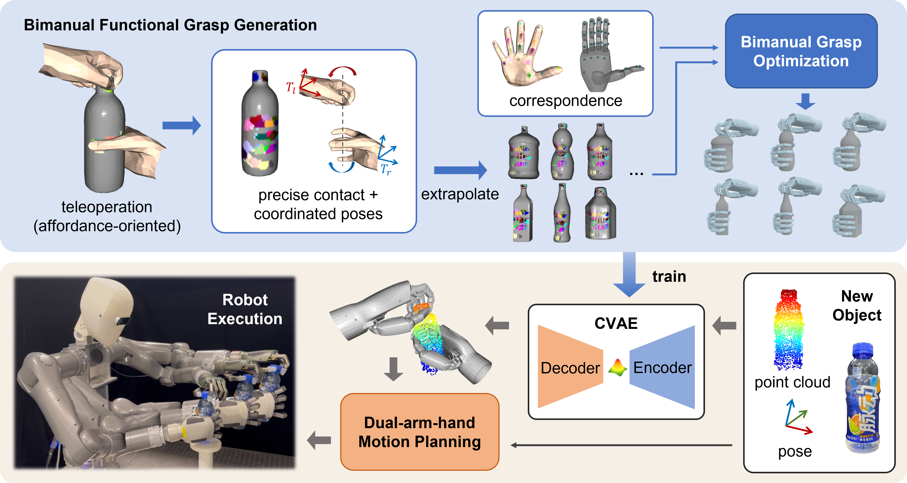

# BFGS-Bimanual-Functional-Grasp-Synthesis
Official repository for "Bimanual Functional Grasp Synthesis with Human Contact Imitation and Inter-hand Coordination"

## To do:
1. upload the synthesized data
2. scripts for visualization
3. update the readme file
